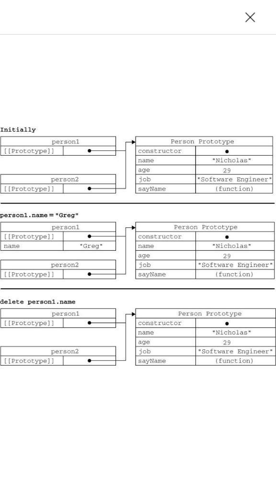
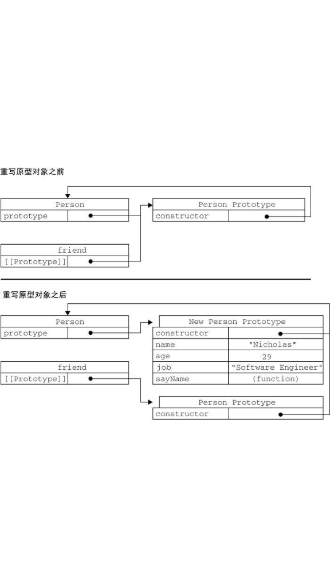

# 构造对象的几种方式 #

​	虽然Object构造函数或对象字面量都可以用来创建单个对象，但这些方式有个明显的缺点：使用同一个接口创建很多对象，会产生大量的重复代码。为解决这个问题，人们开始使用工厂模式的一种变体。

1. #### 工厂模式

---

```JS
function  createPerson(name,  age,  job){

 var o =  new  Object();

 o.name =  name;

 o.age =  age;

 o.job =  job;

 o.sayName =  function(){

 alert(this.name);

 };

 return  o;

}
 var  person1 =  createPerson("Nicholas",  29,  "Software  Engineer");

 var  person2 =  createPerson("Greg",  27,  "Doctor");
```


​    函数createPerson()能够根据接受的参数来构建一个包含所有必要信息的Person对象。可以无数次地调用这个函数，而每次它都会返回一个包含三个属性一个方法的对象。工厂模式虽然解决了创建多个相似对象的问题，但却没有解决对象识别的问题（即怎样知道一个对象的类型）。随着JavaScript的发展，又一个新模式出现了。

2. #### 构造函数


```js
function Person( name, age, job){

     this. name = name; 

    this. age = age;

    this. job = job; 

    this. sayName = function(){

             alert( this. name); 
             };
     } 

var person1 = new Person(" Nicholas", 29, "Software Engineer"); 
var person2 = new Person(" Greg", 27, "Doctor");

alert(person1.constructor  ==  Person);   //true
alert(person2.constructor  ==  Person);   //true

alert(person1  instanceof  Object);   //true
alert(person1  instanceof  Person);   //true
alert(person2  instanceof  Object);   //true
alert(person2  instanceof  Person);   //true

//  作为普通函数调用
 Person("Greg",  27,  "Doctor");  //  添加到window
 window.sayName();  //"Greg"

 //  在另一个对象的作用域中调用
 var o =  new  Object();
 Person.call(o,  "Kristen",  25,  "Nurse");
 o.sayName();  //"Kristen"

```


1.  没有显式地创建对象；

2. 直接将属性和方法赋给了this对象；

3. 没有return语句。

   惯例，构造函数始终都应该以一个大写字母开头，而非构造函数则应该以一个小写字母开头。

   以这种方式定义的构造函数是定义在Global对象（在浏览器中是window对象）中的。


   ##### 将构造函数当作函数

---

   ##### 构造函数的问题

---

   构造函数的问题构造函数模式虽然好用，但也并非没有缺点。使用构造函数的主要问题，**就是每个方法都要在每个实例上重新创建一遍。**	

   ​	对象就共享了在全局作用域中定义的同一个sayName()函数。这样做确实解决了两个函数做同一件事的问题，可是新问题又来了：在全局作用域中定义的函数实际上只能被某个对象调用，这让全局作用域有点名不副实。而更让人无法接受的是：如果对象需要定义很多方法，那么就要定义很多个全局函数，于是我们这个自定义的引用类型就丝毫没有封装性可言了。

  

3. #### 原型模式

---

​	我们创建的每个函数都有一个`prototype`（原型）属性，这个属性是一个指针，指向一个对象，而这个对象的用途是包含可以由特定类型的所有实例共享的属性和方法。如果按照字面意思来理解，那么prototype就是通过调用构造函数而创建的那个对象实例的原型对象。

```js
function  Person(){
}

 Person.prototype.name =  "Nicholas";
 Person.prototype.age =  29;
 Person.prototype.job =  "Software  Engineer";
 Person.prototype.sayName =  function(){
     alert(this.name);
 };

 var  person1 =  new  Person();
 person1.sayName();    //"Nicholas"

 var  person2 =  new  Person();
 person2.sayName();    //"Nicholas"

 alert(person1.sayName  ==  person2.sayName);   //true

//如果[[Prototype]]指向调用isPrototypeOf()方法的对象（Person.prototype），
 alert(Person.prototype.isPrototypeOf(person1));   //true
 alert(Person.prototype.isPrototypeOf(person2));   //true

//  ECMAScript 5增加了一个新方法，叫Object.getPrototypeOf()，在所有支持的实现中，这个方法返回[[Prototype]]的值。
 alert(Object.getPrototypeOf(person1)  ==  Person.prototype);  //true
 alert(Object.getPrototypeOf(person1).name);  //"Nicholas"

//hasOwnProperty()方法可以检测一个属性是存在于实例中，还是存在于原型中。来的）只在给定属性存在于对象实例中时，才会返回true。
 alert(person1.hasOwnProperty("name"));   //false
```

​	在此，我们将sayName()方法和所有属性直接添加到了Person的`prototype`属性中，构造函数变成了空函数。即使如此，也仍然可以通过调用构造函数来创建新对象，而且新对象还会具有相同的属性和方法。但与构造函数模式不同的是，新对象的这些属性和方法是由所有实例共享的。

- ##### 理解原型对象

  ​	无论什么时候，只要创建了一个新函数，就会根据一组特定的规则为该函数创建一个`prototype`属性，这个属性指向函数的原型对象。在默认情况下，所有原型对象都会自动获得一个`constructor`（构造函数）属性，这个属性包含一个指向prototype属性所在函数的指针。就拿前面的例子来说，`Person.prototype.constructor`指向`Person`。

  ​	当调用构造函数创建一个新实例后，该实例的内部将包含一个指针（内部属性），指向构造函数的原型对象。叫`[[Prototype]]` 即	` _proto_`。就是，这个连接存在于**实例与构造函数的原型对象**之间，而不是存在于实例与构造函数之间。

  ​	可以通过**`isPrototypeOf() `**方法来确定对象之间是否存在这种关系。

  ​	虽然可以通过对象实例访问保存在原型中的值，但却不能通过对象实例重写原型中的值。当为对象实例添加一个属性时，这个属性就会屏蔽原型对象中保存的同名属性；

  ​	ECMAScript 5的`Object.getOwnPropertyDescriptor()`方法只能用于实例属性，要取得原型属性的描述符，必须直接在原型对象上调用`Object.getOwnPropertyDescriptor()`方法。


  ​	有两种方式使用in操作符：**单独使用和在for-in**循环中使用。在单独使用时，in操作符会在通过对象能够访问给定属性时返回true，无论该属性存在于实例中还是原型中。

  ​	在使用for-in循环时，返回的是所有能够通过对象访问的、可枚举的（`enumerated`）属性，

  ​	同时使用`hasOwnProperty()方法和in`操作符，就可以确定该属性到底是存在于对象中，还是存在于原型中。`hasOwnProperty()`只在给定属性存在于对象实例中时返回`true`。

  ​	所有可枚举的实例属性，可以使用ECMAScript 5的`Object.keys()`方法。这个方法接收一个对象作为参数，返回一个包含所有可枚举属性的字符串数组。

  ​	你想要得到所有实例属性，无论它是否可枚举，都可以使用**`Object.getOwnPropertyNames()`**方法。






- 更简单的原型语法

  更常见的做法是用一个包含所有属性和方法的对象字面量来重写整个原型对象，

  ```
  f unction Person(){
  }
  
  Person.prototype = {
       name :  "Nicholas",
       age :  29,
       job:  "Software  Engineer",
       sayName :  function  () {
           alert(this.name);
      }
   };
   var  friend =  new  Person();
  
   alert(friend  instanceof  Object);         //true
   alert(friend  instanceof  Person);         //true
   
  	// 例外：constructor属性不再指向Person了。
   alert(friend.constructor  ==  Person);     //false
   alert(friend.constructor  ==  Object);     //true
   
  // 如果constructor的值真的很重要，可以像下面这样特意将它设置回适当的值。
   function Person(){}
   Person.prototype = {
       constructor : Person,
       name :  "Nicholas",
       age :  29,
       job:  "Software  Engineer",
       sayName :  function  () {
           alert(this.name);
      }
   };
   //重设constructor属性会导致它的[[Enumerable]]特性被设置为true。默认情况下，原生的constructor属性是不可枚举的，
  ```

- 原型的动态性

  ​	实例中的指针仅指向原型，而不指向构造函数。重写原型对象切断了现有原型与任何之前已经存在的对象实例之间的联系；它们引用的仍然是最初的原型。

- 原生对象的原型

  `Array.prototype`中可以找到`sort()`方法，而在`String.prototype`中可以找到substring()方法，

- 原型对象的问题

  ​	缺点。首先，它省略了为构造函数传递初始化参数这一环节，结果所有实例在默认情况下都将**取得相同的属性值**。虽然这会在某种程度上带来一些不方便，但还不是原型的最大问题。原型模式的最大问题是由其**`共享的本性`**所导致的。对于包含**引用类型值的属性**来说，问题就比较突出了。

  ​	实例一般都是要有属于自己的全部属性的。而这个问题正是我们很少看到有人单独使用原型模式的原因所在。

- 


4. ### 组合使用构造函数模式和原型模式

---

​	创建自定义类型的最常见方式，就是**组合使用构造函数模式与原型模式**。构造函数模式用于定义实例属性，而原型模式用于定义方法和共享的属性。

```js
function  Person(name,  age,  job){
     this.name =  name;
     this.age =  age;
     this.job =  job;
     this.friends =  ["Shelby",  "Court"];
}

 Person.prototype = {
     constructor :Person,
     sayName :  function(){
         alert(this.name);
    }
}

 var  person1 =  new  Person("Nicholas",  29,  "Software  Engineer");
 var  person2 =  new  Person("Greg",  27,  "Doctor");

 person1.friends.push("Van");
 alert(person1.friends);     //"Shelby,Count,Van"
 alert(person2.friends);     //"Shelby,Count"
 alert(person1.friends  ===  person2.friends);     //false
 alert(person1.sayName  ===  person2.sayName);     //true
```

5. ### 　动态原型模式

   ----


   ```js
   function Person(name, age, job){
       / /属性
       this.name = name;
       this.age = age;
       this.job = job;
   
    //方法
    if  (typeof  this.sayName  !=  "function"){
   
        Person.prototype.sayName =  function(){
                alert(this.name);
            };
   
       }
   }
   
    var  friend =  new  Person("Nicholas",  29,  "Software  Engineer");
    friend.sayName();
   ```

6. ### 　寄生构造函数模式

   ---

   ​	寄生（parasitic）构造函数模式。这种模式的基本思想是创建一个函数，该函数的作用仅仅是封装创建对象的代码，然后再返回新创建的对象；

```js
function  Person(name,  age,  job){
     var o =  new  Object();
     o.name =  name;
     o.age =  age;
     o.job =  job;
     o.sayName =  function(){
         alert(this.name);
     };    
     return  o;
}

 var  friend =  new  Person("Nicholas",  29,  "Software  Engineer");
 friend.sayName();   //"Nicholas"
```

​	假设我们想创建一个具有额外方法的**特殊数组**。由于不能直接修改Array构造函数，因此可以使用这个模式。

```js
function  SpecialArray(){

     //创建数组
     var  values =  new  Array();

     //添加值
     values.push.apply(values,  arguments);

     //添加方法
     values.toPipedString =  function(){
         return  this.join("|");
     };

     //返回数组
     return  values;
}

 var  colors =  new  SpecialArray("red",  "blue",  "green");
 alert(colors.toPipedString());  //"red|blue|green"
```
说明：首先，返回的对象与构造函数或者与构造函数的原型属性之间没有关系；也就是说，构造函数返回的对象与在构造函数外部创建的对象没有什么不同。为此，不能依赖instanceof操作符来确定对象类型。

7. ### 稳妥构造函数模式

   ---

   ​	稳妥对象（durable  objects）这个概念。所谓稳妥对象，指的是没有公共属性，而且其方法也不引用this的对象。一是新创建对象的实例方法不引用this；二是不使用new操作符调用构造函数。

   ​	与寄生构造函数模式类似，使用稳妥构造函数模式创建的对象与构造函数之间也没有什么关系，因此instanceof操作符对这种对象也没有意义。

   [浅谈稳妥构造函数模式的实现原理与机制]: <https://blog.csdn.net/maomaolaoshi/article/details/73928094>


```js
 function  Person(name,  age,  job){
     //创建要返回的对象
 var o =  new  Object();//可以在这里定义私有变量和函数

 //添加方法
 o.sayName =  function(){
     alert(name);
 };    

 //返回对象
 return  o;
  
 }
var  friend =  Person("Nicholas",  29,  "Software  Engineer");
 friend.sayName();   //"Nicholas"
```