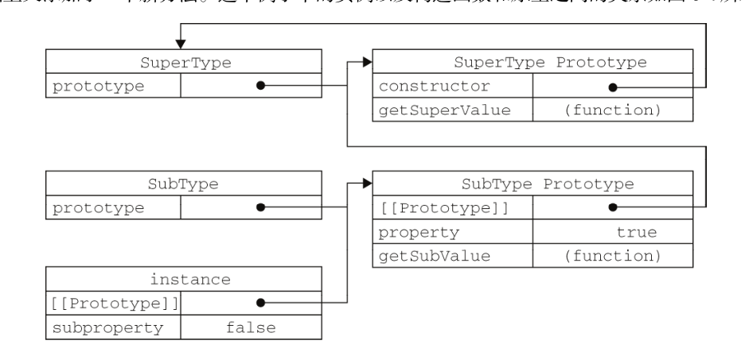

# 继承

​	实现继承主要是依靠原型链来实现的。

1. ## 原型链

   ​	原型链的概念，并将原型链作为实现继承的主要方法。其基本思想是利用原型让一个引用类型**继承**另一个引用类型的属性和方法。

   让原型对象等于另一个类型的实例，原型对象将包含一个指向另一个原型的指针，相应地，另一个原型中也包含着一个指向另一个构造函数的指针。

   ​	在确立了继承关系之后，我们给SubType.prototype添加了一个方法，这样就在继承了SuperType的属性和方法的基础上又添加了一个新方法。这个例子中的实例以及构造函数和原型之间的关系如图6-4所示。

```
            function  SuperType(){
                 this.property =  true;
            }
             SuperType.prototype.getSuperValue =  function(){
                 return  this.property;
             };

             function  SubType(){
                 this.subproperty =  false;
            }

             //继承了SuperType
             SubType.prototype =  new  SuperType();

             SubType.prototype.getSubValue =  function  (){
                 return  this.subproperty;
             };

             var  instance =  new  SubType();
             alert(instance.getSuperValue());       //true
```


