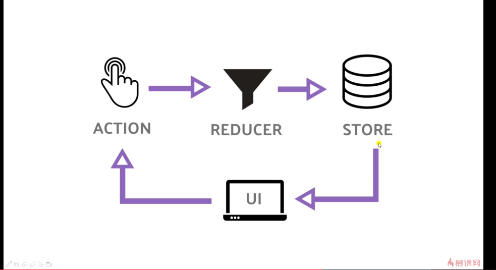

### ssr 服务端渲染

nextjs 自带服务器，只处理ssr渲染；

只处理页面请求，js请求，对于数据请求不属于他的范畴

数据接口，数据库连接，session状态---无法完成，所以使用koa；


### redis  

内存数据解构存储

可持久存储，存储硬盘；

支持多种数据结构

`setex c 10  1`     10s为过期时间，c为key


router 的钩子

路由变化之前，变化之后，监听


### nextjs 提供的getInitProps 

保持前端和后端数据同步；

`a.getInitialProps=()=>{`

`return {`

`}`

`} `


### 自定義App

固定Layout

保持一些公用的状态

给页面传入一些自定义数据

自定义错误处理

### 自定义document

只在服务端渲染时调用

一般用在css-in-js


```js
enhanceApp:App=>App,//默认的或者配置的
enhanceComponent:Comment=>Comment//路由对应的
```


### 定义样式

next不支持css文件加载，需要使用css-ins-js方案

### lazyloading

异步加载模块  moment依赖  可在getInitialProps中import

异步加载组件  使用 dynamic（import（）），只有使用时才加载

```
const withCss = require('@zeit/next-css')
const config = require('./config')

const configs = {
  // 编译文件的输出目录
  distDir: 'dest',
  // 是否给每个路由生成Etag，页面缓存，有了Nginx的就可以关掉
  generateEtags: true,
  // 页面内容缓存配置，是否需要在内存缓存，不用服务端渲染
  onDemandEntries: {
    // 内容在内存中缓存的时长（ms）
    maxInactiveAge: 25 * 1000,
    // 同时缓存多少个页面
    pagesBufferLength: 2,
  },
  // 在pages目录下那种后缀的文件会被认为是页面
  pageExtensions: ['jsx', 'js'],
  // 配置buildId，多个节点部署的时候会用到
  generateBuildId: async () => {
    if (process.env.YOUR_BUILD_ID) {
      return process.env.YOUR_BUILD_ID
    }

    // 返回null使用默认的unique id
    return null
  },
  // 手动修改webpack config，可修改默认的webpack配置
  webpack(config, options) {
    return config
  },
  // 修改webpackDevMiddleware配置
  webpackDevMiddleware: config => {
    return config
  },
  // 可以在页面上通过 procsess.env.customKey 获取 value，webpack常用，拿配置项
  env: {
    customKey: 'value',
  },
  // 下面两个要通过 'next/config' 来读取
  // 只有在服务端渲染时才会获取的配置
  serverRuntimeConfig: {
    mySecret: 'secret',
    secondSecret: process.env.SECOND_SECRET,
  },
  // 在服务端渲染和客户端渲染都可获取的配置
  publicRuntimeConfig: {
    staticFolder: '/static',
  },
}

if (typeof require !== 'undefined') {
  require.extensions['.css'] = file => {}
}

const GITHUB_OAUTH_URL = 'https://github.com/login/oauth/authorize'
const SCOPE = 'user'

module.exports = withCss({
  publicRuntimeConfig: {
    GITHUB_OAUTH_URL,
    OAUTH_URL: `${GITHUB_OAUTH_URL}?client_id=${
      config.github.client_id
    }&scope=${SCOPE}`,
  },
})
```


koa server， next为中间件，next开始渲染--》app的getInitialProps=>

component的getInitialProps=》react渲染出最终的html，=》返回


## Hooks

让函数组件具有类组件的能力；

可以写function组件，拥有this；useState，useEffect；

### state hooks

使用方式，API：useState（封装），useReducer(基础)

setCount 两种用法

setCount（1），setCount（(c)=>{c+1}）(最新的count值加一)

setCount（count+1）闭包陷阱，

useReducer

类似于reducer

countReducer为reducer方法；

[count,dispatch]=useReducer(countReducer,0);0为初始值


effect hooks；

effect特性，初始化时，effect invocked；setState后，都会deteched卸载，再invoked；如果：

`useEffect(()=>{`

`effect invoked`

`return effect deteched`

`},[name])`

数组里的项如果未变化，则不会触发invoked和deteched

建议：写在useEffect中的项，都在数组中定义

useLayoutEffect

1、永远比effect早执行；

2、会在没有真正的更新到html之前，就会更新；执行完毕才会挂在dom；


### context hooks

需要最新de context api

```js
<Mycontext.Provider value={'test'}>//value可以更新，
    <Component/>
</Mycontext.Provider>
```

useContext(Mycontext)

### ref Hooks

```
this.ref=React.createRef();
<span ref={this.ref}></>
this.ref.current//使用
```

使用对象实例，在function component 里使用的话如下:

```
const inputRef=useRef()
<input ref={inputRef}></input>
console.log(inputRef)//{current:{}}
```


### 优化hooks

memo，useCallback,useMemo;来做优化，类似shouldUpdate；

```


const config=useMemo(()=>{
	text:`count is ${count}`
},[count])//count 不变不会重新render；

const handleButtonClick=useCallback(
()=>{
	dispatchCount(type:'add')
},[])//count 不变不会重新render；

const Child=memo(function component)；

```


## 闭包陷阱

可以使用 useRef（）


## redux

单项数据流；flux数据流规范




```
combineReducers//combine
store.getState()//获取state
store.subscribe(()=>{})//监听state变化

createStore(allReducers,{state},middleWare())


function addAsync(num) {
  return (dispatch,getState) => {
    setTimeout(() => {
      dispatch(add(num))
    }, 1000)
  }
}
store.dispatch(addAsync(4))
```

reducer不应有任何副作用；外部变量禁止；


## react-redux

使用provide提供获取全局store功能，

```
<Provide store=store></>
```

## redux-dev-tool

```
 composeWithDevTools(applyMiddleware(ReduxThunk)),
```

### nextjs中的HOC

代码复用；

接收组件作为参数并返回新的组件；


### nextjs集成redux


同步服务端数据到客户端

：：store服务端共用一个，状态不更新，导致不重新初始化，所以需要服务端需要重新render后需要重新create；


服务端如何写入数据到store

如何同步服务端数据到客户端


